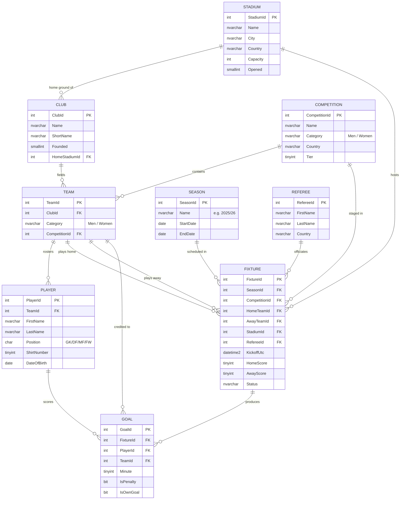

# The sample database

--8<-- "includes/clock-morning-3.md"

Every demo in this workshop deploys **one canonical sample database**: a small
football schema that covers **both the men's and women's game**. It's deliberately compact
— big enough to be realistic, small enough to reason about while you focus on the *real*
subject: shipping schema as code.

!!! note "One schema, three ways"
    This same schema is defined as a **SQL project** (`.sqlproj` / DACPAC — our focus),
    and mirrored as **Flyway** and **dbatools/dbops** migrations. Whatever tool you prefer,
    the tables, views and procedures are identical.

## The domain

- A **Club** (Arsenal, Barcelona…) is the institution. Each club fields more than one
  **Team** — a **men's** team and a **women's** team — so both games live in one model
  without duplication.
- Each **Team** plays in a **Competition** (e.g. *Premier League* for the men, *Women's
  Super League* for the women) during a **Season**.
- **Players** belong to a team; **Referees** officiate matches.
- A **Fixture** is a single match; its score is empty until it's played. Each goal is
  recorded as a row in **Goal** (penalties and own goals flagged).

## Entity relationship diagram



## Tables at a glance

| Table | What it holds |
|-------|---------------|
| `Stadium` | Grounds — name, city, country, capacity. |
| `Club` | The institution; links to its home `Stadium`. |
| `Competition` | A league, tagged `Category` = **Men** or **Women**. |
| `Season` | A season window, e.g. *2025/26*. |
| `Team` | One row per club per category, in a `Competition`. |
| `Player` | Squad members, linked to a `Team`. |
| `Referee` | Match officials. |
| `Fixture` | A match; scores are `NULL` until it's played. |
| `Goal` | One row per goal, with penalty / own-goal flags. |

## Views and stored procedures

Ready-made objects you'll deploy and query as you follow along:

| Object | Type | Purpose |
|--------|------|---------|
| `vw_LeagueTable` | View | Standings computed from played fixtures (3 for a win, 1 for a draw). |
| `vw_TopScorers` | View | Goals per player, by competition and season. |
| `vw_UpcomingFixtures` | View | Matches still to be played, with friendly names. |
| `usp_GetLeagueTable` | Procedure | The league table for one competition + season, correctly ordered. |
| `usp_RecordFixtureResult` | Procedure | Record a final score and mark a fixture played. |
| `usp_TransferPlayer` | Procedure | Move a player to a different team. |

## Seed data

The database ships with a **repeatable, self-contained seed**: real clubs and players
across the **Premier League** and **Women's Super League**, a handful of played fixtures
(so `vw_LeagueTable` and `vw_TopScorers` return data straight away), and some upcoming
El Clásico fixtures for `vw_UpcomingFixtures`. Re-deploying never duplicates rows.

!!! tip "Try it once the seed is deployed"
    ```sql
    -- Women's Super League table for 2025/26
    EXEC football.usp_GetLeagueTable @CompetitionId = 2, @SeasonId = 1;

    -- Who's scoring?
    SELECT Player, Team, Competition, Goals, Penalties
    FROM   football.vw_TopScorers
    ORDER  BY Goals DESC;
    ```

## The demo

This page describes the schema. Deploying it is the
**[Database demo](demo.md)** — build the DACPAC, publish it, and then change it.

## Get the code

The schema and seed are downloadable with each database module — you deploy them from
code, never by clicking. The canonical source lives in
[`database/sql-projects`](https://github.com/JessAndRob/FabConEU_2026_workshop/tree/main/database/sql-projects)
in the workshop repo.

## What's next

Next: [Database as code — SQL projects](sql-projects.md) — how that schema becomes a
deployable artifact.
