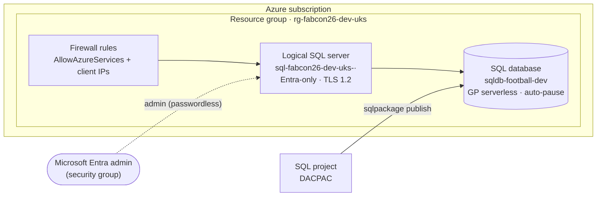

# Azure SQL as code (Terraform)

Provision an Azure SQL server and database with **Terraform** — a resource group, a logical server,
a serverless database, and a firewall rule, all from a handful of `.tf` files. No portal clicking,
no admin password, fully repeatable.

!!! tip "The hands-on part is on the demo page"
    This page is the *why* and the *what*. The commands — `terraform init`, `plan`, `apply` and
    the teardown afterwards — are walked through step by step on
    **[Infrastructure as code demo](demo.md)**.

## What gets built

| Resource | Name (default) | Notes |
|---|---|---|
| Resource group | `rg-fabcon26-dev-uks` | |
| Logical SQL server | `sql-fabcon26-dev-uks-<rnd>` | Globally unique; TLS 1.2 min; **Entra-only auth** |
| SQL database | `sqldb-football-dev` | Serverless, auto-pause 60 min, 2 GB — a cost-aware lab default |
| Firewall rule | `AllowAzureServices` | Lets the pipeline runner reach the server |



## The concept

**Infrastructure as code**: the server and database are declared, not clicked. Terraform reads the
`.tf` files, works out the diff against real Azure, and applies it. Three ideas do the heavy lifting:

- **State** — Terraform records what it created, in a remote Azure Storage backend so you and CI
  share one source of truth (auth is AAD/OIDC — no storage keys). On a laptop we swap that for
  local state, which is one file copy on the demo page.
- **Passwordless** — the server is **Microsoft Entra-only** (`azuread_authentication_only = true`):
  no SQL admin login, no password, nothing secret to commit or rotate. The Entra admin is best set
  to a **security group**, because a logical server allows only one.
- **CAF naming** — names follow the Azure Cloud Adoption Framework (`rg-`, `sql-`, `sqldb-`) with
  `fabcon26` as the workload token, so a `*fabcon26*` filter finds — and tears down — everything.

## Terraform (focus) / Bicep (reference)

=== "Terraform"
    The taught path, and the one we run live. The module needs just two values from you —
    `entra_admin_login` and `entra_admin_object_id` — and everything else has a cost-aware
    default. Three commands do the work: `terraform init` fetches the providers, `terraform plan`
    shows you what would change, and `terraform apply` makes Azure match the code.

=== "Bicep"
    The same infrastructure is mirrored in **Bicep** for the ARM-native crowd — a subscription-scoped
    `main.bicep` creates the RG and calls `sql.bicep` (server + serverless DB + firewall, Entra-only).
    Compile with `az bicep build`, deploy with `az deployment sub create`. It's a reference variant;
    the taught path is Terraform.

## The demo

👉 **[Infrastructure as code demo](demo.md)** — the Azure SQL walkthrough, from signing in to
`terraform apply` and the teardown at the end. The same page covers the Fabric path afterwards.

## The code

The module lives in
[`infra/azure-sql/terraform/demo`](https://github.com/JessAndRob/FabConEU_2026_workshop/tree/main/infra/azure-sql/terraform/demo).
The Bicep reference is in
[`infra/azure-sql/bicep`](https://github.com/JessAndRob/FabConEU_2026_workshop/tree/main/infra/azure-sql/bicep).
Download the module bundle and run it from code — nothing is clicked.

## Checkpoint

By the end of this section a resource group, a logical server and a serverless database exist in
your subscription, all created by `terraform apply`, and you can sign in to that database
**passwordless** with your Entra identity. It is the target the
[SQL project's DACPAC](../database/sql-projects.md) publishes into.

## Gotchas

- **Naming:** the CAF type-abbreviation leads (`rg-`/`sql-`/`sqldb-`), `fabcon26` is the workload
  token, and the globally-unique server gets a short random suffix.
- **Passwordless needs a real identity:** supply the Entra admin — a **group** is best (one group,
  everyone in it, including the CI identity, since a server allows only one Entra admin).
- **A Sponsorship/MSDN subscription can be region-restricted** below what the resource provider
  advertises. If `apply` fails with *"Subscriptions are restricted from provisioning in this
  region"*, move `location` + `location_abbreviation` together and retry.
- **Keep Terraform state out of the workload resource group** — the nightly destroy tears the
  workload down; state lives in its own persistent account so it's never deleted.

??? warning "`terraform plan` fails with *\"Account has previously been signed out of this application\"* (Windows)"
    The `azurerm` provider fetches a **Microsoft Graph** token to parse your identity claims. If
    the CLI's Graph token goes stale, every `plan` fails at the provider block — even though
    `az account get-access-token` (ARM scope) succeeds. On Windows the culprit is usually the
    **WAM broker** silently reusing a poisoned account, so a plain `az login` does not fix it.
    Disable the broker, clear the cache, and log in with **device code** (which bypasses WAM):

    ```powershell
    az config set core.enable_broker_on_windows=false
    az account clear
    Remove-Item "$env:USERPROFILE\.azure\msal_token_cache.*" -Force -ErrorAction SilentlyContinue
    az login --use-device-code
    az account set --subscription $env:ARM_SUBSCRIPTION_ID
    ```

    Verify the **Graph** scope specifically returns an expiry (not the error) before re-running
    `plan`:

    ```powershell
    az account get-access-token --scope https://graph.microsoft.com/.default --query expiresOn -o tsv
    ```

## What's next

Next: [Fabric SQL as code](fabric-sql.md) — the same, side by side on Fabric.
