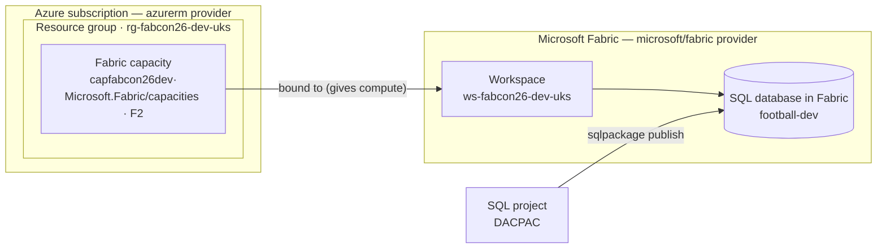

# Fabric SQL as code (Terraform)

Provision **SQL database in Fabric** with **Terraform** — the same "as code" story as Azure SQL,
one step longer. Where Azure SQL is *server → database*, Fabric is *capacity → workspace →
database*, and it takes **two providers** to build. No portal clicking, no password, fully
repeatable — side by side with the Azure SQL module.

!!! success "Verified end-to-end (task #20, 2026-08-20)"
    The Fabric module has been deployed live: one pipeline run provisions the capacity binding →
    workspace → SQL database, publishes the DACPAC, and passes a data smoke test — passwordless,
    side by side with Azure SQL. Open follow-ups (none block this flow): nightly clean-slate
    teardown (#26) and a least-privilege capacity-access refactor (#27).

!!! note "Follow along — or just watch"
    Needs your own Azure subscription **and** a Fabric capacity. See [Prerequisites](../setup/prerequisites.md).

!!! warning "This is *SQL database in Fabric* — not the Fabric Data Warehouse"
    Our target is the **transactional** SQL database in Fabric, which is engine-compatible with
    Azure SQL (IDENTITY, enforced constraints, indexes, views, procedures all work) — so the
    *same* schema and DACPAC deploy to both. The Fabric **Data Warehouse** is a different, much
    smaller T-SQL surface; we don't target it. Details:
    [`notes/fabric-sql-notes.md`](https://github.com/JessAndRob/FabConEU_2026_workshop/blob/main/notes/fabric-sql-notes.md).

## What you'll build

The taught path provisions the whole stack as code (the module can also **bind to a capacity you
already run** — see the gotchas):

| Resource | Name (default) | Provider | Notes |
|---|---|---|---|
| Resource group | `rg-fabcon26-dev-uks` | azurerm | Holds the capacity |
| Fabric capacity | `capfabcon26dev<rnd>` | azurerm | `Microsoft.Fabric/capacities`, **F2** SKU — **bills continuously** |
| Workspace | `ws-fabcon26-dev-uks` | microsoft/fabric | The container for Fabric items, bound to the capacity |
| SQL database | `football-dev` | microsoft/fabric | The **SQL database in Fabric** the DACPAC publishes into |



The extra moving part versus Azure SQL is the **capacity**, and the dashed boundary is the
provider split: `azurerm` builds the capacity (an Azure resource), `microsoft/fabric` builds the
workspace and database (Fabric items) — one `terraform apply` authenticates to both.

## The concept

**Infrastructure as code**, one provider heavier than Azure SQL:

- **Two providers, by necessity.** The **capacity** is an *Azure* resource
  (`azurerm_fabric_capacity`), but the **workspace** and **SQL database** are Fabric items managed
  by the **`microsoft/fabric`** provider over the Fabric REST APIs. So a single `terraform apply`
  authenticates to **both** — azurerm for the capacity, the fabric provider for everything on top.
- **capacity → workspace → database.** The capacity is the compute/billing unit; a workspace binds
  to it (that's what gives the database compute); the SQL database lives in the workspace. Azure
  SQL's *server → database* has no capacity to reason about.
- **Passwordless.** Both providers use Microsoft Entra (reuse `az login` locally; OIDC in CI) — no
  keys, nothing secret to commit.

## Azure SQL / Fabric SQL

=== "Azure SQL"
    **server → database.** One provider (`azurerm`). A logical server holds the database; a
    serverless SKU auto-pauses when idle, so cost takes care of itself. See the
    [Azure SQL page](azure-sql.md).

=== "Fabric SQL"
    **capacity → workspace → database.** Two providers (`azurerm` + `microsoft/fabric`). The extra
    moving part is the **capacity** — it has real cost implications (an F-SKU bills continuously,
    with no serverless auto-pause), so teardown or pausing matters more than on Azure SQL.

## The code

The module lives in
[`infra/fabric-sql/terraform`](https://github.com/JessAndRob/FabConEU_2026_workshop/tree/main/infra/fabric-sql/terraform).
Run it just like the Azure SQL module, from the module folder:

```powershell
cd infra/fabric-sql/terraform   # from the repo root

Copy-Item terraform.tfvars.example terraform.tfvars   # optional — all values have defaults
code terraform.tfvars                                 # open it to review/edit the variables

# Local demo: use local state instead of the remote Azure Storage backend
Copy-Item backend_local_override.tf.example backend_local_override.tf

az login
$env:ARM_SUBSCRIPTION_ID = "<your-subscription-id>"          # state backend / CLI
$env:TF_VAR_fabric_subscription_id = $env:ARM_SUBSCRIPTION_ID # required by the module

terraform init
terraform plan     # see exactly what will be created
terraform apply
```

!!! note "Why the override?"
    Same as Azure SQL: the module ships with a remote **`azurerm`** backend (Azure Storage,
    AAD/OIDC) for CI and shared state. On a laptop that backend has no storage account to
    talk to, so a bare `terraform init` prompts for a container name. Copying
    `backend_local_override.tf.example` swaps in a **local** backend for the demo — no Azure
    Storage account, no prompts. The file is gitignored, so it never disturbs the remote
    backend CI relies on.

Bicep can only provision the **capacity** (the workspace + SQL database have no ARM resource
type), so the full stack is Terraform-only — see
[`infra/fabric-sql/bicep`](https://github.com/JessAndRob/FabConEU_2026_workshop/tree/main/infra/fabric-sql/bicep).

## Checkpoint

`terraform apply` created the capacity (or bound to your existing one), the workspace, and the SQL
database — reachable at `…database.fabric.microsoft.com,1433`, signed in **passwordless** with your
Entra identity. That database is the target the
[SQL project's DACPAC](../database/sql-projects.md) publishes into — the *same* DACPAC as Azure SQL,
only the publish profile changes.

## Gotchas

- **Two providers means two auths** — `azurerm` (`ARM_*`) for the capacity + state, and the
  `microsoft/fabric` provider (`FABRIC_*`) for the workspace + database. In GitHub Actions the
  fabric provider auto-detects the OIDC token, so `id-token: write` is the only extra wiring.
- **A Fabric tenant admin must enable *"Service principals can use Fabric APIs"*** — without it a
  pipeline identity can't touch Fabric at all. No Terraform or pipeline can flip this setting; it's
  the one hard prerequisite a human has to arrange.
- **Capacity names are lowercase-alphanumeric only** (`^[a-z][a-z0-9]*$`, no hyphens), so they
  can't take the CAF hyphenated form — the module builds the name from the same tokens minus
  separators, with a `cap` prefix and a random suffix (capacity names are globally unique).
- **An F-SKU bills continuously** — there's no serverless auto-pause. Either let the nightly
  destroy tear it down, or **pause it when idle**. The module also has a `use_existing_capacity`
  toggle: bind the workspace to a capacity you run and pause yourself, and Terraform will **never**
  destroy it (it's a read-only data source, not managed state).
- **A workspace created by a service principal is invisible to humans** — the creating SP is its
  only member. The module grants the presenters the **Admin** role **as code**
  (`fabric_workspace_role_assignment`), because the workspace is recreated on every apply and a
  portal grant wouldn't survive.
- **Resolving an *existing* capacity needs capacity-admin rights** — the `fabric_capacity` data
  source only lists capacities the principal administers, so binding to one you didn't create is a
  one-time out-of-band grant (the Fabric analog of the Azure SQL Entra-admin step).

## What's next

Next: [Database as code — SQL projects](../database/sql-projects.md).
